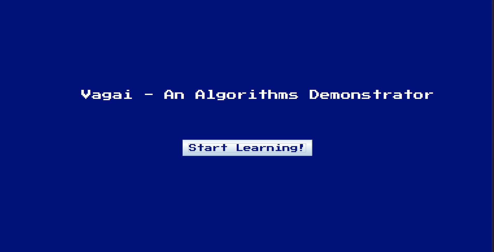
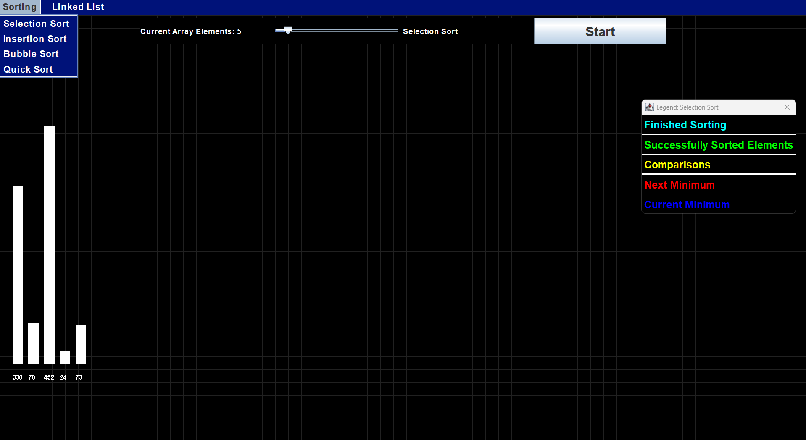
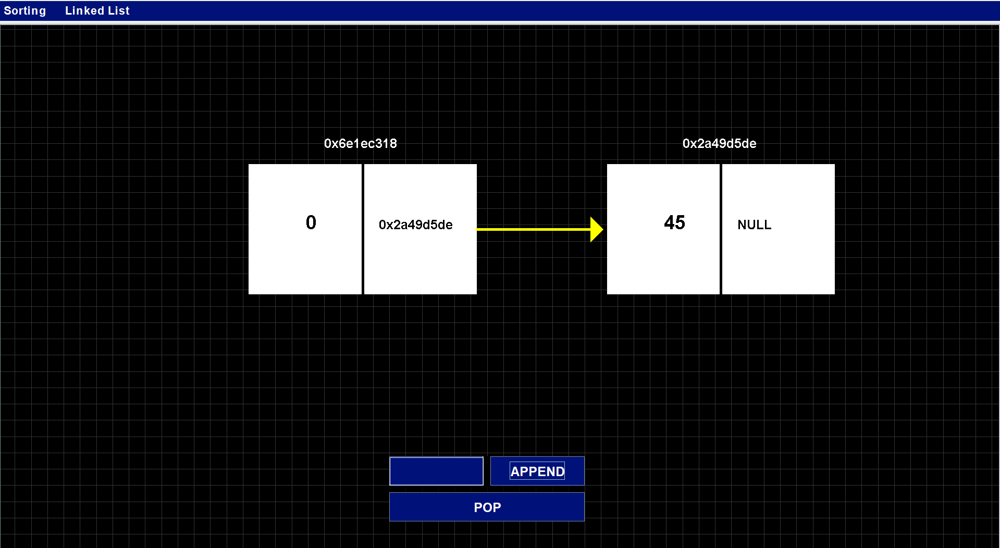
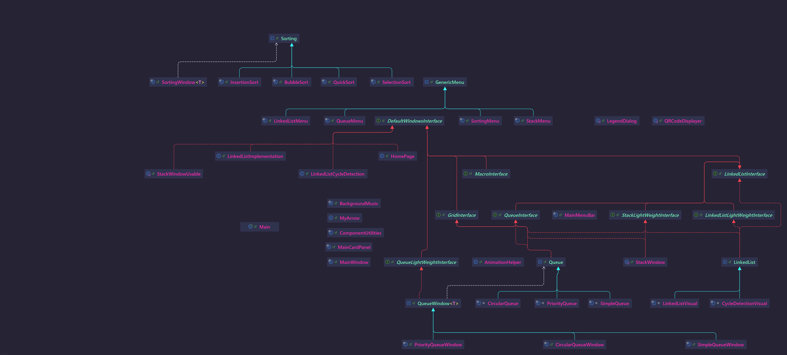

# Tharavarithal— Algorithms Demonstrator - 0.0.1

### A simple 2D graphical demonstration of popular sorting algorithms — visually appealing and self-explanatory.

---

##  Table of Contents
- [About](#about)
- [Features](#features)
- [Demo](#demo)
- [Getting Started](#getting-started)
    - [Prerequisites](#prerequisites)
    - [Installation](#installation)
    - [Usage](#usage)
- [Supported Algorithms](#supported-algorithms)
- [Current Versions](#version)
- [Class Diagram](#class-diagram)
---

## About
Tharavarithal(**Tharavu+Arithal** transl. **Data+Learning**) is a Java-based application that renders real-time, intuitive visualizations of common sorting algorithms in two dimensions. Its goal is to make algorithmic behavior transparent and accessible to learners and enthusiasts alike.

---

## Features
- **2D Graphical Visualizations** — Watch sorting operations unfold naturally.
- **Self-Explanatory** — Minimal UI; visuals speak for themselves.
- **Educational Value** — Ideal for teaching and understanding algorithm dynamics.

---

## Demo
- **This is the start screen**
</img>
- 
version 0.0.0 changed(UI colors and some functionalities)

-*Sorting Screen since version 0.0.1*
</img>
-*Added: Linked List functionalities since version 0.0.1*
</img>

OLDER VERSION 0.0.0

- **This is the Selection Sort Screen with Legend**
</img>
- **The following is the Insertion Sort Screen with Legend**
</img>
-**Finally Bubble Sort... I am still working on quick Sort**
</img>
---

## Getting Started

### Prerequisites
- Java Development Kit (JDK) 8 or higher
- (Optional) Your choice of IDE (e.g., IntelliJ IDEA, Eclipse) or command-line tools

### Installation & Running
1. **Clone the repository**  
2. **Have an IDE like IntelliJ if you are aiming to learn JAVA Swing**

### Version
***Current Version: 0.0.1***

### Class Diagram
- 
Project Classes

</img>
