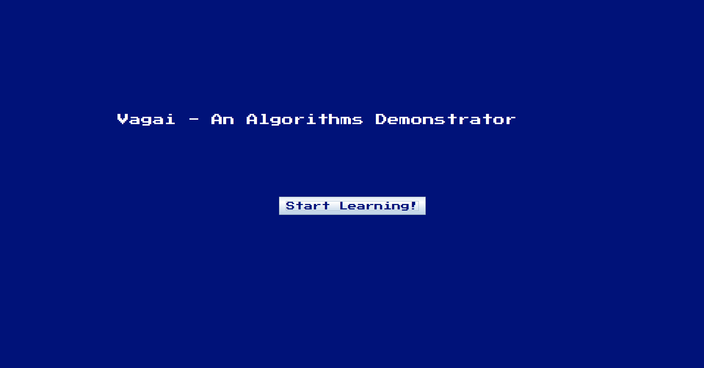
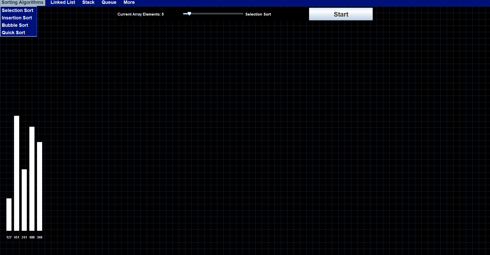
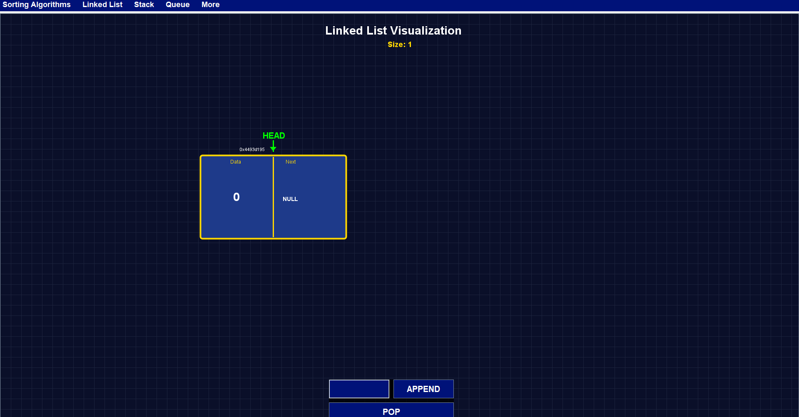
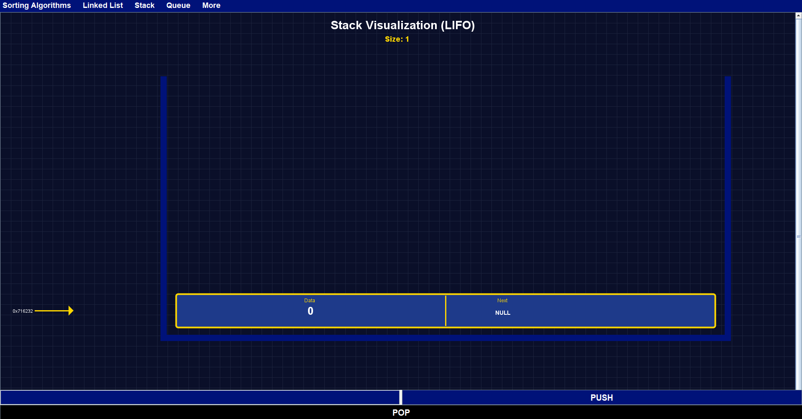
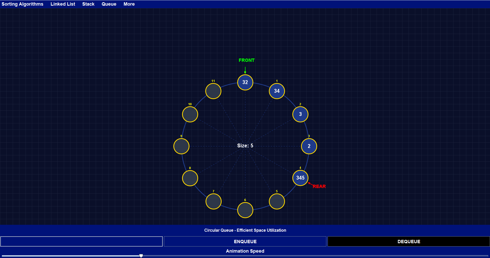
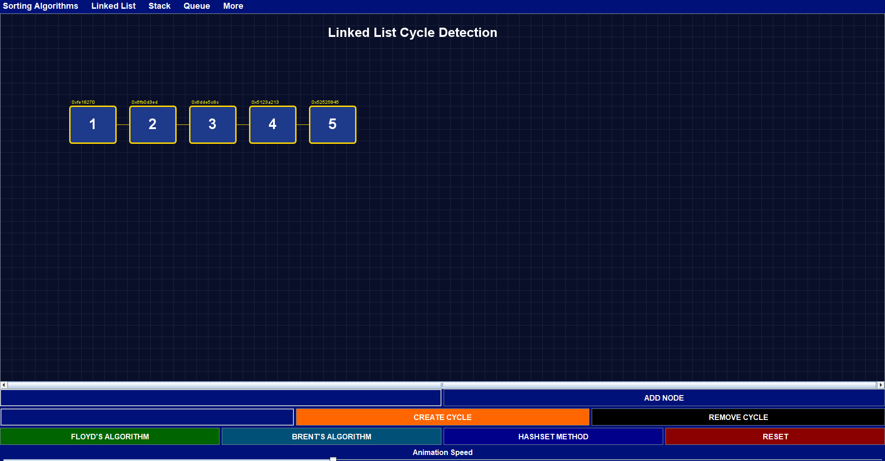
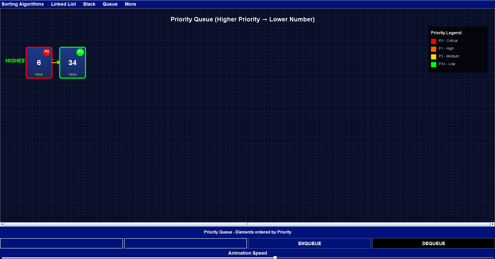
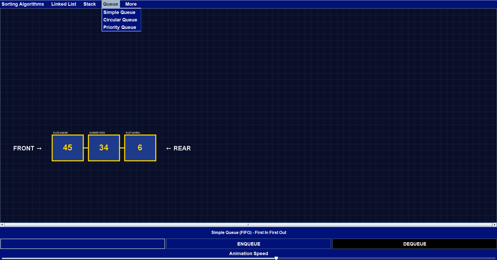

# Vagai— Algorithms Demonstrator - V-0.0.3

### A simple 2D graphical demonstration of popular sorting algorithms — visually appealing and self-explanatory.

---

##  Table of Contents
- [About](#about)
- [Features](#features)
- [Demo](#screenshots)
- [Supported Algorithms](#supported-algorithms)
- [Current Versions](#version)
- [Class Diagram](#class-diagram)
---

## About
Vagai(**Vagai+Paduthal** transl. **Sorting**) is a Java-based application that renders real-time, intuitive visualizations of various algorithms and data structures in two dimensions. Its goal is to make algorithmic behavior transparent and accessible to learners and enthusiasts alike.

---
## Features
- **2D Graphical Visualizations** — Watch sorting operations unfold naturally.
- **User Friendly** - Enables users to learn and experiment around with algorithms, data structures themselves.
- **Self-Explanatory** — Minimal UI; visuals speak for themselves.
- **Educational Value** — Ideal for teaching and understanding algorithm dynamics.
---
## Screenshots
- **This is the start screen**
</img>
- **Sorting Screen since version 0.0.1**
</img>
- **Added: Linked List functionalities from version 0.0.2**
</img>
- **Added: Stack functionalities (Under Development) from version 0.0.2**
</img>
- **Added: Circular Queue from version 0.0.3**
</img>
- **Added: Cycle detection algorithms from version 0.0.3**
</img>
- **Added: Priority Queue from version 0.0.3**
</img>
- **Added: Queue from version 0.0.3** 
</img>
---
### Prerequisites
- Java Development Kit (JDK) 8 or higher
- (Optional) Your choice of IDE (e.g., IntelliJ IDEA, Eclipse) or command-line tools
---
### Installation & Running
1. **Clone the repository**  
2. **Have an IDE like IntelliJ if you are aiming to learn JAVA Swing**
---
### Version
***Current Version: 0.0.3***
---
### Class Diagram
- 
Project Classes

</img>
